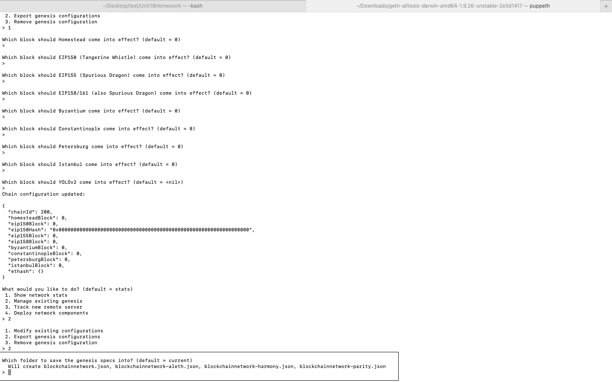
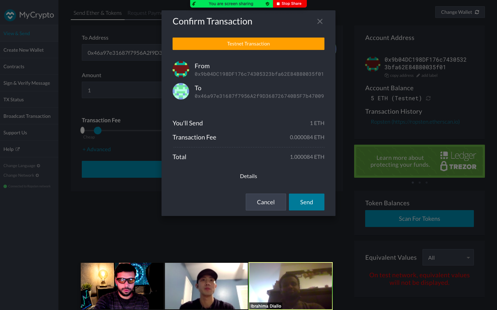
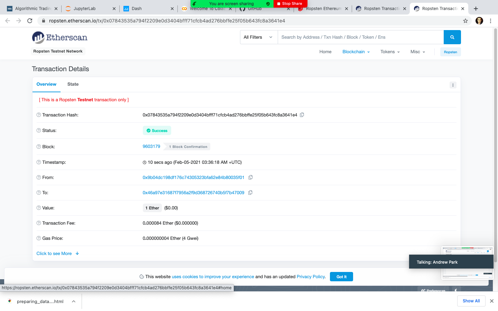
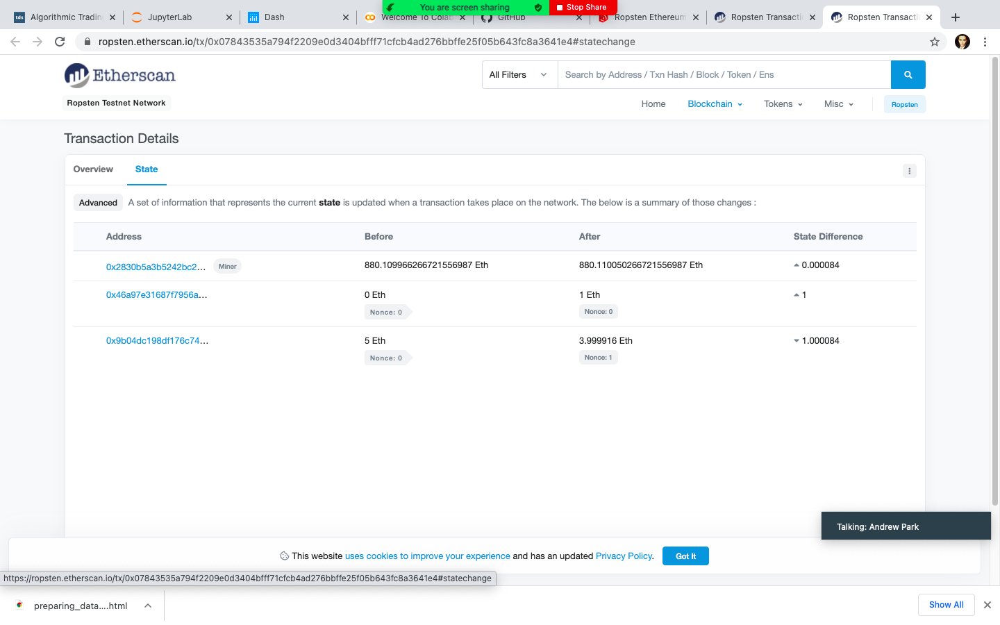

# Unit 18 Homework Testnet Blockchain Network

*I'm working on my first project at work to build a private testnet blockchain. The tools I'm using is as follow:* 

- Puppeth
- Geth
- Proof of Authority Algorithm

## Network Information & Configuration

**Below is the information of the Testnet Blockchain Network:**

   | Item | Description |
   | --- | --- |
   | Network Name          | blockchainhomework
   | Network ID      | 200
   | Public Key       | 0xa46f4ebfb23073a1e6d18f81b62cbb889f78f567
   | Node3 P Key | 0x9b04DC198DF176c74305323bfa62E84B80035f01
   | Node4 P Key | 0x46a97e31687f7956A2f9D368726740B5F7b47009

*Here is a screenshot of the puppeth configuration:*

**Here is the Guide on how to locate the Nodes Folder and how to run both Nodes:**
1. Go to your Terminal: Change Directory to the Geth-AllTool Folder on your Computer.

**cd Downloads/geth-alltools-darwin-amd64-1.9.26-unstable-2e5d1417**

2. Start running the nodes starting from node3 by running the following command on your Geth Folder:

**./geth --datadir node3 --mine --minerthreads 1 --rpc**

**wait until you see "looking for peers" after you run the above command**

3. Open another tab on the same directory by using (Command + T) shortcut and start running node4 by typing the following command:

**./geth --datadir node4 --port 30304 --bootnodes enode://c2f3276ac337c812286ec91a65d328eb6921f86083f9da612061d739faf62987c45c33b7997db4caddae0736bf54758e2804bc55587e0dfc67fb0b2546061750@127.0.0.1:30303 --mine --minerthreads 1**

4. Send a Transaction using MyCrypto App

**Go to Change Network and fill all the required fields by using the information below:**

| Node Name:       | could be anything
| --- | --- |
| Network:         | Custom
| Network Name:    | blockchainhomework
| Currency:        | ETH
| Chain ID:        | 200
| URL:             | https://127.0.0.1:30303

## Screenshots

**Once you are able to save & use custom nodes then you can send a test coin from your first node to the second note**

*Here is a screenshot of the transfer confirmation in between nodes*

**Successful Transaction Confirmation using Keystor to send coin from node3 to node4:**

*Here is a screenshot*

